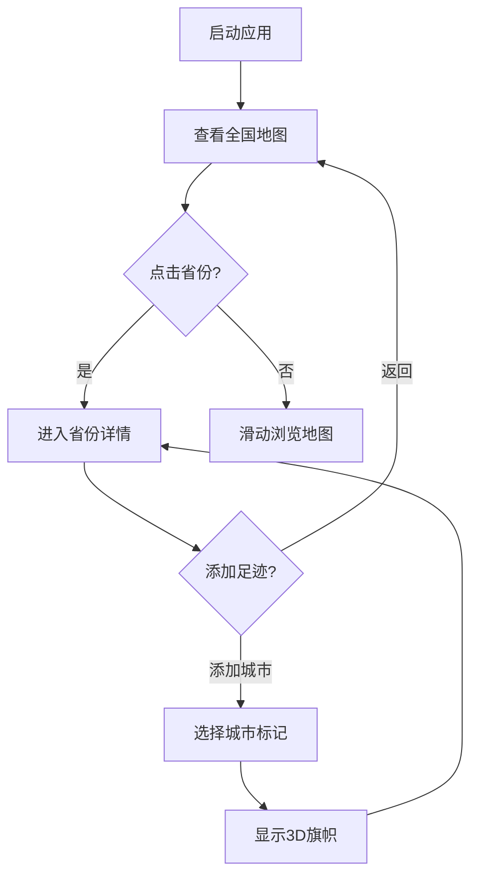

# 旅游足迹记录器 - 产品需求文档

## 1. 产品概述

一个交互式的中国旅游足迹记录应用，用户可以在精美的3D中国地图上标记自己去过的省份和具体城市。滑动浏览全中国，点击省份深入查看省内地图，通过3D旗帜直观展示旅行足迹。

**目标用户**：热爱旅行、希望可视化记录旅行足迹的用户
**核心价值**：将旅行记忆以视觉化、艺术化的方式呈现，激发探索欲望

## 2. 核心功能

### 2.1 用户角色

| 角色 | 说明 | 权限 |
|------|------|------|
| 访客 | 直接使用应用 | 浏览地图、添加/删除足迹标记 |

### 2.2 功能模块

1. **全国地图视图**
   - 3D渲染的中国地图，支持滑动浏览
   - 已访问省份显示3D旗帜标记
   - 悬停省份显示省份名称和访问状态

2. **省份详情视图**
   - 点击省份进入省级地图
   - 显示省内已访问城市标记
   - 支持缩放、拖拽浏览

3. **足迹管理**
   - 添加新足迹（选择省份/城市）
   - 删除足迹标记
   - 查看足迹统计

4. **数据持久化**
   - 使用LocalStorage存储足迹数据
   - 数据自动保存

## 3. 核心流程

### 3.1 主要用户流程

### 3.2 添加足迹流程

1. 用户点击空白省份区域
2. 弹出添加足迹面板
3. 选择城市/地点
4. 确认添加
5. 在对应位置显示3D旗帜

## 4. 用户界面设计

### 4.1 设计风格

**风格定位**：现代旅行杂志风格 + 轻量级3D可视化

**配色方案**：
- 主色：#1E3A5F（深邃海洋蓝）
- 强调色：#F59E0B（暖阳金）
- 背景：#0F172A（夜空深蓝）
- 文字：#F8FAFC（雪白）
- 未访问省份：#334155（石墨灰）
- 已访问省份：#22D3EE（青碧色）

**字体**：
- 标题：Noto Serif SC（衬线体，优雅）
- 正文：Noto Sans SC（无衬线，清晰）

**动效**：
- 页面加载：省份依次淡入（staggered animation, 30ms间隔）
- 旗帜飘动：CSS 3D transform模拟风吹效果
- 地图缩放：smooth transition 400ms ease-out
- 悬停效果：省份轻微上浮 + 发光边缘

### 4.2 页面设计

#### 全国地图视图
| 元素 | 描述 |
|------|------|
| 地图容器 | 全屏3D场景，深色渐变背景 |
| 3D地图 | GeoJSON渲染的省份，支持旋转缩放 |
| 旗帜标记 | CSS 3D模拟旗帜，带阴影和动画 |
| 省份标签 | 悬停时显示省份名称tooltip |
| 统计面板 | 右上角显示访问统计 |
| 操作提示 | 左下角显示操作说明 |

#### 省份详情视图
| 元素 | 描述 |
|------|------|
| 省级地图 | 3D渲染的省份区域 |
| 城市标记 | 可点击添加/删除的城市点 |
| 我的足迹 | 已添加的城市旗帜 |
| 返回按钮 | 左上角返回全国视图 |
| 缩放控制 | 右下角 +/- 按钮 |

### 4.3 3D场景设计

**环境设置**：
- 背景：深蓝渐变 + 星点粒子效果
- 氛围：夜间俯瞰视角，有神秘感

**光照**：
- 主光源：暖色调（模拟月光）
- 边缘光：省份轮廓发光效果
- 环境光：柔和填充

**旗帜设计**：
- 材质：丝绸质感，半透明
- 动画：轻微飘动（3秒循环）
- 颜色：红黄渐变（中国元素）
- 阴影：投射到地图表面

**交互反馈**：
- 悬停：省份发光 + 缩放1.02x
- 点击：涟漪扩散效果
- 添加成功：旗帜弹出动画

### 4.4 响应式设计

- **桌面优先**：优化大屏体验
- **平板适配**：触摸手势支持
- **移动端**：简化3D效果，保证基本功能

## 5. 技术需求

- 使用React + Three.js实现3D地图
- 使用GeoJSON数据渲染省份边界
- CSS 3D模拟旗帜（性能优化）
- LocalStorage持久化存储
