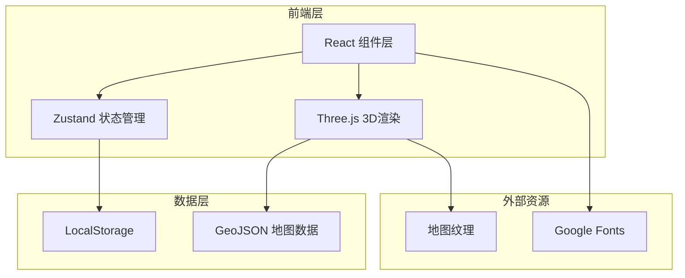

# 旅游足迹记录器 - 技术架构文档

## 1. 架构设计



## 2. 技术选型

- **框架**：React@18 + Vite
- **样式**：Tailwind CSS@3
- **3D渲染**：Three.js + @react-three/fiber
- **状态管理**：Zustand
- **地图数据**：中国省份GeoJSON
- **字体**：Google Fonts (Noto Serif SC, Noto Sans SC)
- **持久化**：LocalStorage

## 3. 组件结构

```
src/
├── components/
│   ├── Map/
│   │   ├── ChinaMap.jsx        # 全国3D地图
│   │   ├── ProvinceMap.jsx    # 省份3D地图
│   │   ├── Province.jsx        # 单个省份组件
│   │   └── CityMarker.jsx     # 城市标记
│   ├── Flag/
│   │   └── Flag3D.jsx         # 3D旗帜组件
│   ├── UI/
│   │   ├── StatsPanel.jsx     # 统计面板
│   │   ├── AddFootprintModal.jsx  # 添加足迹弹窗
│   │   └── BackButton.jsx     # 返回按钮
│   └── Scene/
│       └── MapScene.jsx       # 3D场景容器
├── store/
│   └── useStore.js            # Zustand状态管理
├── data/
│   ├── chinaGeoJSON.js        # 中国地图数据
│   └── provincesData.js       # 省份信息
├── utils/
│   └── storage.js             # 存储工具
├── App.jsx
└── main.jsx
```

## 4. 路由定义

| 路由 | 组件 | 描述 |
|------|------|------|
| / | ChinaMap | 全国地图视图（默认） |
| /province/:id | ProvinceMap | 省份详情视图 |

## 5. 数据模型

### 5.1 足迹数据模型

```typescript
interface Footprint {
  id: string;
  provinceId: string;      // 省份ID
  cityId: string;          // 城市ID
  cityName: string;        // 城市名称
  createdAt: number;       // 创建时间戳
}

interface AppState {
  footprints: Footprint[];  // 足迹列表
  currentView: 'china' | 'province';
  currentProvince: string | null;
  addFootprint: (footprint: Omit<Footprint, 'id' | 'createdAt'>) => void;
  removeFootprint: (id: string) => void;
  setCurrentProvince: (provinceId: string | null) => void;
}
```

### 5.2 LocalStorage存储

- **Key**: `travel-footprints`
- **Value**: JSON.stringify(Footprint[])

## 6. 核心功能实现

### 6.1 3D地图渲染

- 使用 `@react-three/fiber` 创建Three.js场景
- 加载GeoJSON数据，使用 `GeoJsonGeometry` 渲染省份边界
- 支持OrbitControls进行缩放、旋转、拖拽

### 6.2 3D旗帜实现

- 使用CSS 3D transforms模拟旗帜飘动
- 动画：rotateY + skewY 组合效果
- 支持响应悬停交互

### 6.3 省份交互

- onClick: 进入省份详情
- onHover: 显示省份名称tooltip
- 悬停效果：emissive材质增强

### 6.4 数据持久化

- 应用启动时从LocalStorage加载数据
- 每次修改自动保存
- 使用Zustand middleware实现自动持久化

## 7. 性能优化

- 使用 `React.memo` 优化组件渲染
- 旗帜使用CSS动画而非Three.js动画
- 按需加载省份地图数据
- 使用 `useMemo` 缓存GeoJSON处理结果
